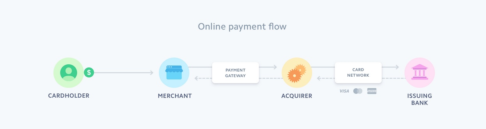

**Table Of Contents**
- [Overview: Accept Simple Payments](#overview-accept-simple-payments)
  - [Key Benefits](#key-benefits)
- [Step-by-Step: Getting Started](#step-by-step-getting-started)
  - [1. Create a Stripe Account](#1-create-a-stripe-account)
  - [2. Create a Payment Link](#2-create-a-payment-link)
  - [3. Share and Go Live](#3-share-and-go-live)
- [Supported Sharing Channels](#supported-sharing-channels)
- [Summary of Startup Use Case](#summary-of-startup-use-case)
- [Sample Markdown Snippet](#sample-markdown-snippet)
  - [Stripe Payment ProcessDiagram](#stripe-payment-processdiagram)


## Overview: Accept Simple Payments


Stripe allows startups to **accept one-off payments without writing code**.  
This is ideal for MVPs, small online shops, or early business models where you need a simple payment path to validate product demand.


### Key Benefits


- No-code payment setup with payment links  
- Works for one-time purchases online  
- Can be shared anywhere (social, email, SMS)
---


## Step-by-Step: Getting Started


### 1. Create a Stripe Account


Before integrating with Stripe:


1. Go to the Stripe signup page and enter your email, full name, country, and password.  
2. Complete your business profile in the Dashboard.  
3. Click **Verify your email** in the Dashboard — Stripe sends a confirmation email.  
   


### 2. Create a Payment Link


Payment Links let customers pay using a single URL.


1. In the *Stripe Dashboard*, open **Payment Links** and click **New**.  
2. Select an existing product or **+ Add a new product**.  
3. Enter product details and click **Add product**.  
4. Click **Create link** to generate a shareable payment URL.


### 3. Share and Go Live


- Copy the payment link and share it anywhere (email, social, website).  
- Go live by adding business and tax details, bank payout information, and enabling two-step authentication.  
- Stripe will move your account from **sandbox** to **live mode** once activated in your account settings.


---


## Supported Sharing Channels


Customers can pay through the payment link posted on:


- Emails  
- Text messages  
- Social media platforms  
- Website buttons or banners
---


## Summary of Startup Use Case


| Stage                     | Description                                            |
|--------------------------|--------------------------------------------------------|
| Account Setup            | Create and verify a new Stripe account                  |
| Payment Link Creation    | Generate shareable payment links for products          |
| Sharing & Go Live        | Publish link online and complete business details      |
| No-Code Integration      | Accept payments without writing backend code           |


---


## Sample Markdown Snippet


Below is an example of a Markdown image and code block you might use in your documentation:

> **Note:** Markdown is the super set of HTML
```
{
    "status":"OK",
    "data":
        {
            "message": "Welcome, world!"
        }
}


### Stripe Payment ProcessDiagram




